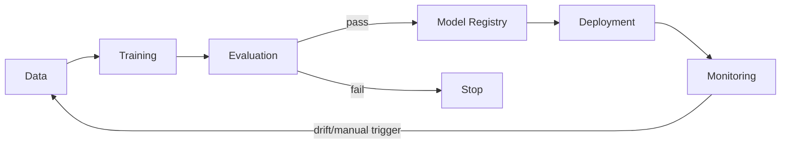

# IIoT Vertex AI Pipeline POC

A minimal, runnable demonstration of the classic ML pipeline flow on **Google Cloud Vertex AI**:



Domain: **Industrial IoT (IIoT)**. A simulated rotating machine (pump/motor) emits
`vibration_mm_s`, `pressure_bar`, `rpm`, and `load_pct` readings; a simple TensorFlow/Keras
regression model predicts `temperature_c` from those readings.

## How this maps to Vertex AI

| Stage | Script | Vertex AI concept |
|---|---|---|
| Data | `data/generate_dataset.py` | Cloud Storage dataset |
| Training | `training/task.py`, `training/train_launcher.py` | `CustomJob` (training) |
| Evaluation | `evaluation/evaluate.py` | Custom evaluation gate |
| Model Registry | `registry/register_model.py` | `Model.upload()` |
| Deployment | `deployment/deploy_endpoint.py` | `Endpoint.create()` + `model.deploy()` |
| Monitoring | `monitoring/setup_monitoring.py` | `ModelDeploymentMonitoringJob` |
| Retraining | `retraining/retrain.py` | Manual re-run of the loop |

## Running locally (default, no GCP calls)

By default `USE_VERTEX_AI=False`, so every stage runs against local files and simply
**logs** the Vertex AI API call it would make instead of calling GCP. This lets you
verify the entire flow end to end with no GCP project required.

```bash
pip install -r requirements.txt
python pipeline/run_pipeline.py
```

Outputs:
- `data/raw/train.csv`, `data/raw/test.csv` — simulated IIoT sensor data
- `artifacts/model/` — trained Keras model + SavedModel export
- `artifacts/metrics.json` — training metrics
- `artifacts/evaluation_result.json` — MAE/RMSE/R² and pass/fail verdict

To demonstrate retraining:

```bash
python retraining/retrain.py
```

This regenerates data (with a simulated drift), retrains, re-evaluates, and only
re-registers/redeploys/re-monitors if the new model passes the evaluation gate.

## Running against a real GCP project

1. `gcloud auth application-default login`
2. Enable the Vertex AI API and create a GCS bucket in your project.
3. Set environment variables:
   ```bash
   export PROJECT_ID=your-gcp-project-id
   export GCS_BUCKET=your-gcs-bucket-name
   export REGION=us-central1
   export USE_VERTEX_AI=True
   ```
4. Run `python pipeline/run_pipeline.py` — this now submits a real `CustomJob`,
   registers the model in Vertex AI Model Registry, deploys a real Endpoint, and
   creates a real `ModelDeploymentMonitoringJob`.

All GCP-facing config (project, region, bucket, thresholds, display names) lives in
[`config.py`](config.py).

## Project structure

Each stage's own README documents its design and implementation in detail:

```
config.py                              # central config, USE_VERTEX_AI switch
data/generate_dataset.py               # Stage 1: simulate IIoT sensor data       -> data/README.md
training/task.py, train_launcher.py    # Stage 2: Keras training + CustomJob      -> training/README.md
evaluation/evaluate.py                 # Stage 3: MAE/RMSE/R2 + pass/fail gate     -> evaluation/README.md
registry/register_model.py             # Stage 4: Model Registry upload           -> registry/README.md
deployment/deploy_endpoint.py          # Stage 5: Endpoint create + deploy         -> deployment/README.md
monitoring/setup_monitoring.py         # Stage 6: drift/skew monitoring job        -> monitoring/README.md
retraining/retrain.py                  # Stage 7: manual retraining trigger        -> retraining/README.md
pipeline/run_pipeline.py               # Orchestrates all stages in order          -> pipeline/README.md
```

- [data/README.md](data/README.md)
- [training/README.md](training/README.md)
- [evaluation/README.md](evaluation/README.md)
- [registry/README.md](registry/README.md)
- [deployment/README.md](deployment/README.md)
- [monitoring/README.md](monitoring/README.md)
- [retraining/README.md](retraining/README.md)
- [pipeline/README.md](pipeline/README.md)

## Notes / limitations

This is a POC, not production code:
- No hyperparameter tuning, cross-validation, or CI/CD.
- Monitoring config uses a fixed drift threshold; no real traffic is generated.
- Serving container is Google's prebuilt TensorFlow image — no custom prediction logic.
